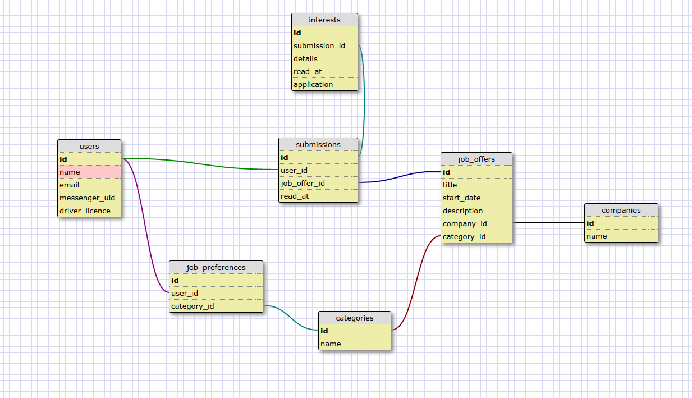

# DRIP

* Ruby version => ruby 2.3.1p112
* Rails version => 5.0.0.1
* System dependencies
* Configuration
* Database creation
* Database initialization
* How to run the test suite
* Services (job queues, cache servers, search engines, etc.)
* Deployment instructions

## About
An API app that get job offers and distribute them through the Facebook Messenger platform (bot).

## Database schema
The db_schema.xml file is included in this github repo.
Here is a screenshot of the v1:



## Test
### RSpec
Tests are performed with RSpec (`rspec-rails`)
All specs are in the `spec` folder.
To run the tests: `bundle exec rspec`

### Continuous Integration
CI is performed via Travis, and connected to Github.
Therefore, when a pull request is made, tests are processed, and Travis tells you if it passed the test or not.

## Service: IndeedApi
For the Indeed api client, we use a service object (POOR) (folder: `app/services`)
No test for it yet (I have to learn how to test Services object with `rspec-rails`)

The Indeed Api service has two public methods:
* `.get_jobs`: which get X jobs_offers per category available in the db.
* `.update_all_current_jobs`: call the Indeed Api for all job_offer in the db, to check if they are expired.

To instance the IndeedApi service:
```
IndeedApi.new(
  publisher_key: ENV["indeed_publisher_key"],
  categories: Category.all.to_a,
  limit: 10
)
```
The publisher key is provided by Indeed when you create an account.
The categories are all the categories you want to query, and get the job_offers for.
The limit is the number of job_offers you want to query.

## Background Jobs
The two IndeedApi methods are called via Background Jobs (folder `app/jobs`).
Sidekiq is the bg queue system used for this app.
For test purpose, you need to install and launch `sidekiq`, in addition to `rails s` to launch the jobs.

## Rake Task
In addition to pure background jobs, we also provide rake task to launch these background jobs.
Therefore, you can launch the task from you terminal (without `rails s`), but you'll still need sidekiq.

Moreover, we use these task on Heroku Scheduler, so we can trigger these jobs once a day. Quite convenient.


## Messenger Bot
Not yet written. :-)


## CONTACT
You can contact me on Twitte: [@dimitribosch](https://twitter.com/dimitribosch)
